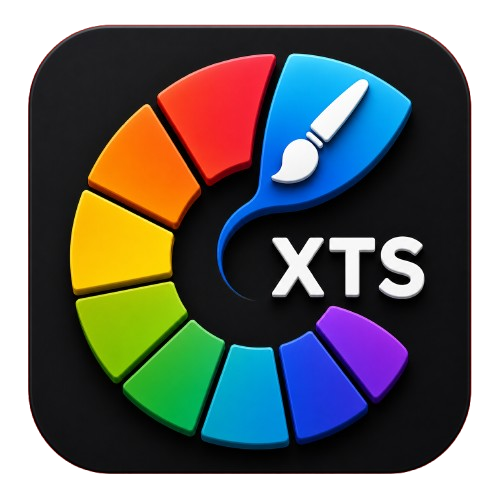
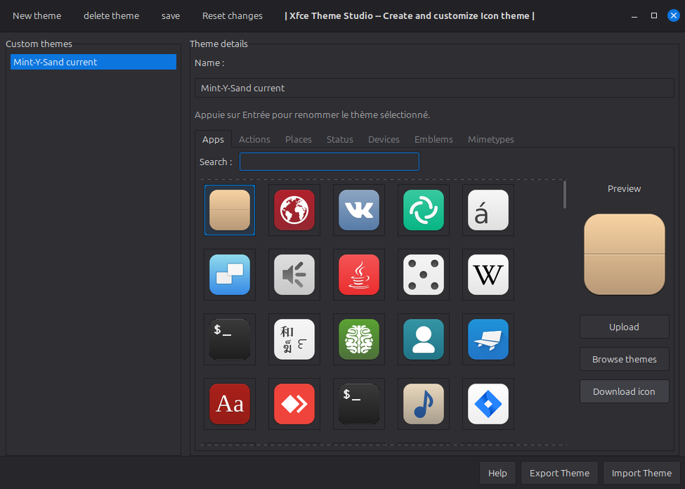
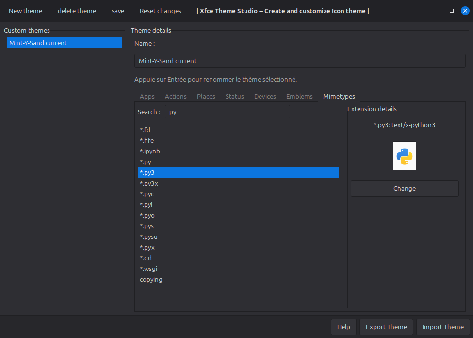
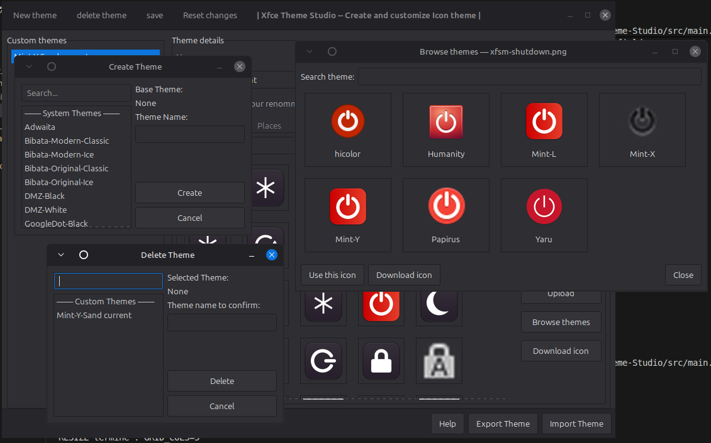

<h1>
  Xfce Theme Studio
  
</h1>

A simple graphical tool to create and customize icon themes for Xfce on Linux

## Description

Xfce Theme Studio is a Python application using PyGObject that allows users to easily create and modify icon themes for the Xfce desktop environment. The intuitive interface facilitates icon management by categories (applications, places, devices, actions, status) and supports SVG and PNG formats.

## Main Features

- Creation of new icon themes
- Modification of existing icons
- Management of system and user themes
- Support for theme inheritance
- Simple and intuitive graphical interface
- Support for SVG and PNG formats

## Installation

### Via .deb (recommended for Linux Mint)

1. Download the `.deb` file from the Releases section
2. Double-click the `.deb` file in your file manager (Thunar) from the Downloads folder to install it automatically.

### Via binary

1. Download the binary from the Releases section
2. Double-click the binary in your file manager. Linux will ask to make it executable; accept to launch the application.

## Usage

After installation, launch the application. You will arrive at a simple interface where you can:

1. Select an existing theme to modify
2. Create a new theme
3. Modify icons by category
4. Save your changes

The interface guides you through the different steps of creating and modifying themes.

## Screenshots

## Dependencies

- Python 3
- Tkinter (included in Python) and PyGObject
- Pillow (PIL)
- CairoSVG

## License

This project is licensed under the GNU General Public License v3.0.

## Author

Developed by Samourai-T3

## Version

Current version: v1.0
Next version: v2.0 (graphical interface change for PyGObject)