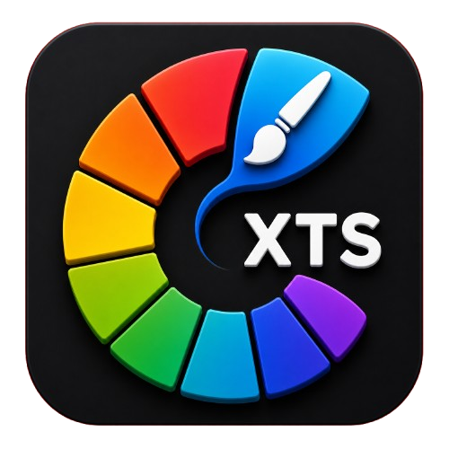
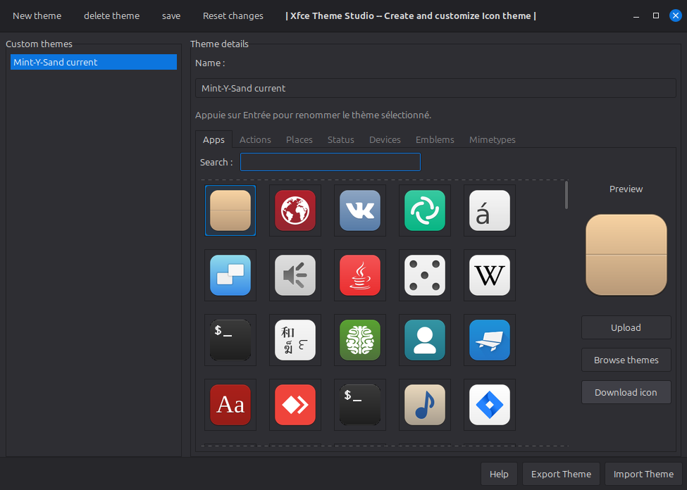
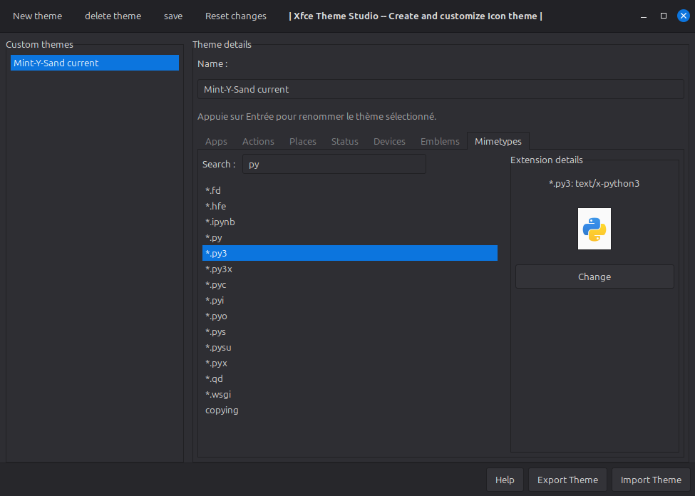
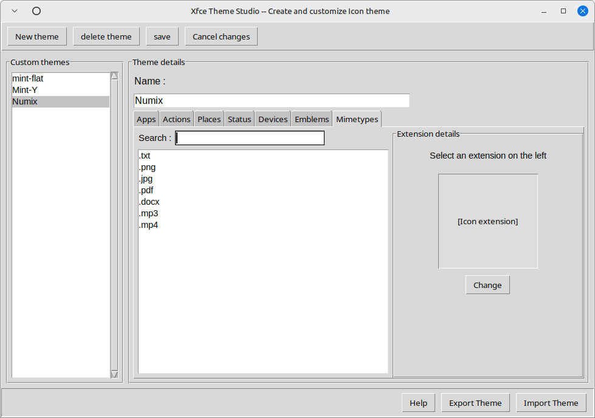
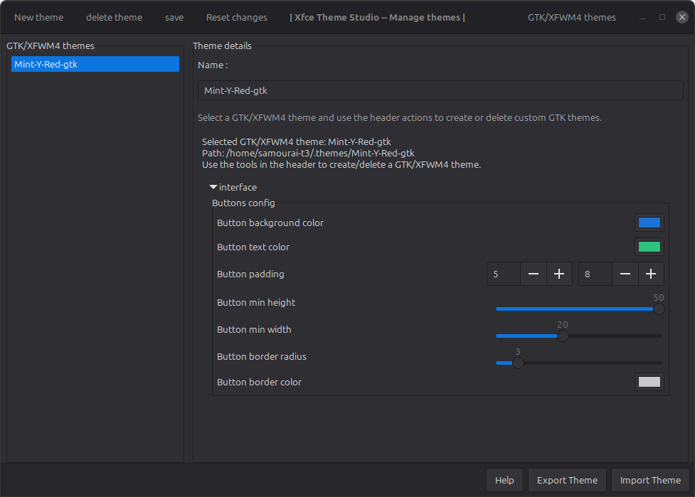

<h1>
  Xfce Theme Studio
  
</h1>

A simple graphical tool to create and customize icon themes for Xfce on Linux

## Description

Xfce Theme Studio is a Python application using PyGObject that allows users to easily create and modify icon themes for the Xfce desktop environment. The intuitive interface facilitates icon management by categories (applications, places, devices, actions, status) and supports SVG and PNG formats.

## Main Features

- Creation of new icon themes
- Modification of existing icons
- Management of system and user themes
- Support for theme inheritance
- Simple and intuitive graphical interface
- Support for SVG and PNG formats

# Installation

1. Download `installer.py` from the Releases section.
2. Open a terminal in the download directory (`cd 'directory'`).
3. Check the latest version and the current installation:
  `python3 installer.py --check`
4. Install or update from the terminal:
  `python3 installer.py`

The installer has no Tkinter dependency. It checks for the required Mint/Debian
packages (`python3-gi`, GTK 3, Cairo, `python3-venv`, `python3-pip`, MIME and
XDG tools), asks for administrator permission only when packages are missing,
and installs Pillow and CairoSVG in a local virtual environment. Use
`python3 installer.py --yes` for a non-interactive install, or
`--no-system-deps` only when those system packages are already installed.

## Screenshots

 

## Dependencies

- Python 3
- PyGObject
- Pillow (PIL)
- CairoSVG

## License

This project is licensed under the GNU General Public License v3.0.

## Author

 **Developed by Samourai-T3**

**Community contributions are welcome.**

You can help improve `theme_structure.py` by adding new customizable elements and parameters.

- Open a Pull Request
- Or send your `theme_structure.py` file by email to: samourai.t3@gmail.com

An example structure is available in:

`examples/theme_structure.py`

## Version

### Current version : 

**v3.4.0**
- Updated `installer.py` to check for required system packages and install missing ones
- Begin xfwm4 theme customization support (in progress but not yet fully functional)
- New mimetype icon to .xts file

### Next versions:

**v3.x**
- Bug fixes
- Stability improvements
- Performance improvements
- GTK compatibility improvements

**v3.x.x**
- New customization elements and parameters
- Expanded `theme_structure.py` support
- Improved theme editing capabilities
- Community contributions for `theme_structure.py`

**v4.0**
- XFWM4 theme customization support